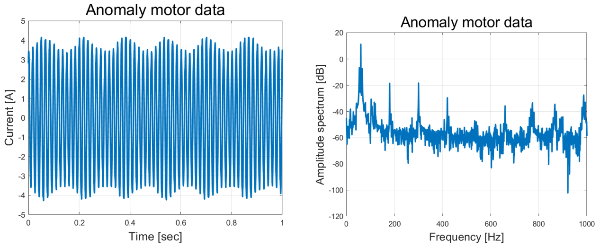
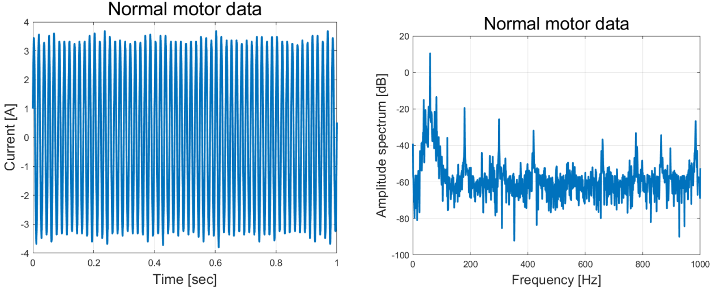

# Outlier Detection in Induction Motors Using MKDE

This repository implements the research from the paper:

**"Outlier Detection Based on Multivariate Kernel Density Estimation in Induction Motors"**  
Authors: Youngjun Sim, Jungyu Choi, Bobae Kim, Sungbin Im

## Overview

### Example Data Visualization
Below are visualizations of normal and anomaly motor data:

This project focuses on detecting anomalies in three-phase induction motors using **Multivariate Kernel Density Estimation (MKDE)**. It extracts frequency-domain features from motor current signals and applies MKDE to detect outliers without requiring predefined distributions.

### Key Results
- **Accuracy:** 98.93% on test data.
- **Robustness:** Effective detection despite data imbalance.

## Features
- **FFT-based Feature Extraction:** Fundamental frequencies and Total Harmonic Distortion (THD).

## Methodology
- **Non-parametric MKDE Model:** Estimates joint probability density functions.
- **Optimal Thresholds:** Silverman’s rule of thumb for bandwidth selection to ensure robust probability density estimation.

## Dataset
- **Source:** [AI Hub](https://aihub.or.kr)
- **Size:** 11,948 samples (10,000 normal, 1,948 anomalous)
- **Split:** 50% training, 50% testing

### Example Data Visualization
Below are visualizations of normal and anomaly motor data:

#### Anomaly Motor Data

#### Normal Motor Data

